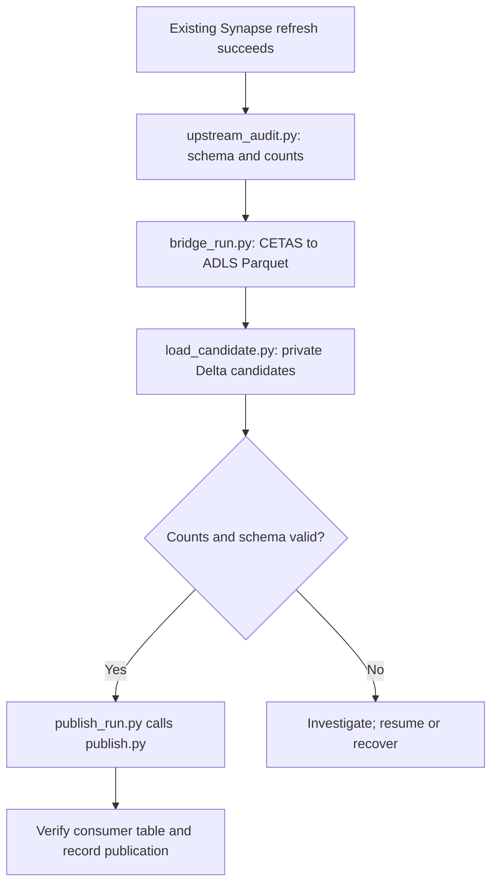

# Synapse → ADLS → Databricks bridge lite v1.3: package and run guide

**Package inspected:** `synapse_databricks_bridge_lite_v1_3(1).zip`  
**Purpose:** Copy independent, once-daily refreshed tables (or simple views over them) from a Synapse dedicated SQL pool to Unity Catalog managed Delta tables. This is a full-table replacement, not CDC or an incremental merge.

## 1. Operating model and terms

| Term | Meaning |
|---|---|
| **Control host** | Machine or job runner executing `python/*.py`; has ODBC access to Azure SQL and Synapse, storage access, and Databricks job authentication. This can be an appropriately configured pipeline task/host, but these scripts are ordinary Python, not Synapse pipeline definitions. |
| **Source object** | A Synapse dedicated-pool table or simple view configured as `source_schema.source_view`. The field is named `source_view` even when the object is a table. |
| **Inventory/config** | Reviewed `config.json` with one mapping per source object, all columns and type rules, schema hash, target, staging root and runtime settings. |
| **Upstream run** | The existing Synapse refresh for one business date, identified by `upstream_run_id` and an increasing sequence. |
| **Bridge run** | An extraction and load for the audited upstream run, identified by `bridge_run_id`. Its release ID is derived from that ID. |
| **Candidate** | Private attempt-specific Delta table; consumers are not pointed at it. |
| **Consumer** | Published Unity Catalog Delta table queried by users. Each consumer table is replaced atomically and independently. |
| **Partial release** | If enabled, healthy tables advance while excluded mappings remain on their previous release. A partial run is not an all-table transaction. |

**Critical scheduling rule:** the existing Synapse refresh must finish before the audit and CETAS reads, and no next refresh may write source tables until `bridge_run.py` finishes reading them. Run the four-stage chain with success dependencies and concurrency **1**. A fixed 02:00 start alone cannot establish this when a refresh runs late. The code cannot detect an unregistered writer that changes rows without changing their count.

## 2. Complete folder tree

```text
bridge_lite_v1_3/
├── README.md
├── DESIGN.md
├── SCRIPT_GUIDE.md
├── WHERE_TO_ENTER_VALUES.md
├── config.example.json
├── requirements.txt
├── requirements-dev.txt
├── python/
│   ├── generate_mappings.py
│   ├── profile_inventory.py
│   ├── source_metadata.py
│   ├── render_setup.py
│   ├── upstream_audit.py
│   ├── bridge_run.py
│   ├── publish_run.py
│   ├── retire_releases.py
│   └── recovery.py
├── databricks/
│   ├── generate_mappings_pyspark.py
│   ├── profile_inventory_pyspark.py
│   ├── load_candidate.py
│   ├── publish.py
│   └── retire_releases.py
├── sql/
│   ├── 01_azure_sql_control.sql
│   ├── 02_synapse_setup.sql
│   ├── 03_upgrade_azure_sql_v1_1.sql
│   └── 04_upgrade_synapse_v1_1.sql
└── tests/
    ├── test_contract.py
    ├── test_static.py
    └── test_orchestration_sim.py
```

### Folder responsibilities

| Folder | What runs there | When |
|---|---|---|
| Package root | Documentation, template configuration, Python requirements | Read/install/configure before deployment |
| `python/` | Control-host scripts using ODBC, ADLS and Databricks APIs | Inventory/setup, each night, maintenance and recovery |
| `databricks/` | Optional inventory notebooks and three job notebooks | Inventory on a cluster; job notebooks are called by control-host scripts |
| `sql/` | Database setup and v1.1-only upgrade SQL | First deployment or applicable upgrade |
| `tests/` | Local checks and simulated orchestration | Before deployment or after modifying code |

## 3. Every root file

| File | Input | Output/purpose |
|---|---|---|
| `config.example.json` | Supplied template; edit or let the generator use it | Starting shape for the reviewed `config.json`; example mappings and placeholder ADLS/catalog/job values are **not** production configuration. |
| `requirements.txt` | `pip install -r requirements.txt` on the control host | Runtime Python dependencies. ODBC Driver 18 is installed separately. |
| `requirements-dev.txt` | `pip install -r requirements-dev.txt` | Test dependencies. |
| `README.md` | None | Deployment commands, recovery evidence examples and production acceptance checks. |
| `DESIGN.md` | None | Supported source model, the no-overlap rule, guarantees and out-of-scope cases. |
| `SCRIPT_GUIDE.md` | None | Package's phase-by-phase script guide. |
| `WHERE_TO_ENTER_VALUES.md` | None | Config fields, identity settings, grants, ADLS external location and Databricks job setup. |

## 4. Each script: purpose, inputs and outputs

### 4.1 Inventory and preparation

| Script / execution location | Purpose | Inputs | Outputs / persistent effect |
|---|---|---|---|
| `python/generate_mappings.py` / control host | Discover all matching Synapse tables or views in **one schema** and create one mapping per supported object, including every column in source order, supported type contracts and schema hashes. | `--schema`, `--source-kind table\|view`, optional `--view-prefix`, `--target-catalog`, `--target-schema`, `--inventory-version`, `--output`; `BRIDGE_SYNAPSE_AUDIT_ODBC`; template `config.example.json`. | New config JSON and `OUTPUT.exceptions.json`. On any unsupported object/type it records exceptions and writes **no config**. Refuses to overwrite an existing output. For `--source-kind table`, each table profiles itself; for views, review the underlying physical-table association. |
| `databricks/generate_mappings_pyspark.py` / Databricks notebook | Alternative to the preceding generator; retrieves Synapse catalog metadata through Spark JDBC and reuses package mapping logic. | Notebook variables `PACKAGE_DIR`, `OUTPUT`, `SOURCE_SCHEMA`, `SOURCE_KIND`, `SOURCE_PREFIX`, `TARGET_CATALOG`, `TARGET_SCHEMA`, `INVENTORY_VERSION`; either `UC_JDBC_CONNECTION` or JDBC URL plus secret scope/keys. Needs the extracted package available in Workspace files and an existing writable UC volume. | Generated config JSON and `.exceptions.json` in the volume. Does not read the source table rows. Do **not** run both generators for the same inventory as sequential stages. |
| `python/profile_inventory.py` / control host | Optional capacity profile using dedicated-pool DMVs, not a data scan; assigns SMALL/MEDIUM/LARGE scheduling classes. | Reviewed `--config`, **new** `--inventory-version`, `--output`; `BRIDGE_SYNAPSE_AUDIT_ODBC`; `profile_thresholds`; reviewed `materialised_schema`/`materialised_table` for a view. | New, immutable profiled config JSON with `size_class`, `source_profile`, `require_profiles=true`, plus `.profile.csv`. Estimated rows and physical bytes are planning values, **not** the exact nightly row-count audit or Parquet size. Replicated physical bytes can include replicas. |
| `databricks/profile_inventory_pyspark.py` / Databricks cluster | Alternative DMV-based profiler. | Input config and output UC-volume paths set in notebook; JDBC connection and Synapse metadata access. Use a cluster able to reach Synapse. | New profiled config JSON and `.profile.csv` in a UC volume. Do not treat it as a second daily load or a substitute for `upstream_audit.py`. |
| `python/source_metadata.py` / control host | Calculate the ordered-column source schema hash; also imported by audit and bridge scripts. | `--schema`, `--view` (also accepts an actual table name in this field); `BRIDGE_SYNAPSE_AUDIT_ODBC`. | Prints `sha256:...` for a manually maintained mapping; does not create a config file. |
| `python/render_setup.py` / control host | Render database setup from the **reviewed** config. | `--config config.json --output-dir generated`. | `generated/azure_sql_seed.sql`: insert missing `bridge.target_state` rows; `generated/unity_catalog_setup.sql`: create candidate and consumer schemas. Execute both separately in their respective platforms. Existing target publication state is not reset. Re-run for each inventory wave. |

**Generator scope:** the automatic generator accepts bounded character types, `int`, `bigint`, `date` and supported `decimal`/`numeric`. Other types need reviewed mapping and CETAS/Spark tests. An `.exceptions.json` report with exceptions is a stop for that generated inventory, not permission to silently drop those objects.

### 4.2 Database setup

| SQL file / execution location | Purpose and input | Output / persistent effect |
|---|---|---|
| `sql/01_azure_sql_control.sql` / **Azure SQL control database** | Run for a fresh installation; provision orchestration user grants separately. | `bridge.runs` (run/lease), `bridge.object_attempts` (per-mapping attempt), `bridge.target_state` (publication/high-water state), `bridge.recovery_events` (operator recovery audit). |
| `sql/02_synapse_setup.sql` / **Synapse dedicated pool** | Administrator prepares a database master key; set the ADLS container in the external data source; configure separate audit and CETAS users/grants. | `bridge_meta` schema, managed-identity scoped credential, `bridge_stage` external data source, `bridge_parquet` format, `bridge_meta.upstream_run` and `bridge_meta.upstream_object`. |
| `sql/03_upgrade_azure_sql_v1_1.sql` / Azure SQL | **Existing v1.1 installations only**, after old runs finish and with a database backup. | Adds loader-attempt state and expands run-status constraint. Not part of a new deployment. |
| `sql/04_upgrade_synapse_v1_1.sql` / Synapse | **Existing v1.1 installations only**, after old jobs finish. | Adds `error_text` to upstream object audits. Not part of a new deployment. |

### 4.3 Nightly chain

| Script / execution location | Purpose and invocation input | Output / persistent effect |
|---|---|---|
| **Your existing Synapse refresh** / existing scheduler | Finish materialising the source tables for the business date. This is **not a script in the ZIP**. | Stable, fully refreshed source tables. Its success starts the audit; no later write may overlap the bridge source reads. |
| `python/upstream_audit.py` / control host | `--config`, a unique `--upstream-run-id`, `--business-date`, optional increasing `--sequence` (defaults to latest + 1); reads each mapped source's schema and `COUNT_BIG(*)`. | Inserts `bridge_meta.upstream_object` observations and one COMPLETE `bridge_meta.upstream_run` transactionally; prints JSON with sequence, COMPLETE count and excluded IDs. With `allow_partial_release=true`, certain object-specific terminal errors/drift can be recorded as EXCLUDED; unclassified errors fail the audit. Duplicate run IDs or stale sequences are rejected. |
| `python/bridge_run.py` / control host | `--config`, audited `--upstream-run-id`, unique `--bridge-run-id`; source/control ODBC, ADLS, Databricks auth; configured loader job. | Creates a bridge run/lease and per-table attempts in Azure SQL. CETAS writes each nonempty source to a new ADLS `attempt-NNN/` Parquet path. Audited empty sources skip CETAS. Writes a hashed manifest, submits the loader job, checks audit = Parquet = Delta counts and records candidates; prints READY/excluded summary. Ends `READY` when eligible tables are prepared; **consumer tables are unchanged**. |
| `databricks/load_candidate.py` / Databricks serverless loader job | Notebook widgets `manifest_path` and `manifest_sha256`; manifest contains staging path, expected schema/count, mapping, attempt and candidate destination. | Validates Parquet columns/order/types, casts into reviewed target types while checking non-null preservation, writes an attempt-specific managed Delta candidate table and returns result JSON with counts. For zero source rows it constructs an empty candidate from the reviewed schema. Called by `bridge_run.py`, not scheduled as a separate nightly step. |
| `python/publish_run.py` / control host | `--config`, `--bridge-run-id` for a READY run; control DB and publisher job access. | Claims each target in Azure SQL; asks publisher to inspect/reconcile and then publish eligible candidates; updates publication state/high-water sequence; prints JSON outcomes. Ends `PUBLISHED` or `PARTIALLY_PUBLISHED`. It does not query Synapse source data. |
| `databricks/publish.py` / Databricks serverless publisher job | Widgets `manifest_path` and `manifest_sha256`; manifest with INSPECT or publish mode, candidate, target, release, count and governed table properties. | INSPECT returns current Delta release/state. Publish uses atomic `CREATE OR REPLACE TABLE ... TBLPROPERTIES ... AS SELECT` and verifies release/count; returns JSON. Called by `publish_run.py`, not scheduled directly. |

**Important visibility boundary:** READY means private candidates passed checks. Users see the new data only after the corresponding consumer table is replaced by the publisher. Each table replaces independently; `PARTIALLY_PUBLISHED` means some tables still show an older day.

### 4.4 Retention and recovery

| Script / location | Purpose and input | Output / persistent effect |
|---|---|---|
| `python/retire_releases.py` / control host | Periodic cleanup: `--config`; optional repeatable `--keep-release`, `--delete-staging`, `--execute`. Without `--execute` it is a dry run. | JSON plan or execution summary. Retains the published and previous release and any explicitly pinned release. Eligible candidate tables are sent to the Databricks retention job; eligible recorded Parquet paths are deleted **only** with `--delete-staging`. Uses published/unpublished retention windows from config. |
| `databricks/retire_releases.py` / Databricks serverless retention job | `manifest_path`, `manifest_sha256`, candidate-drop list; UC privileges. | Rechecks the current consumer release before dropping candidate tables and returns dropped/skipped JSON. Called by the control-host retention script. |
| `python/bridge_run.py --resume` / control host | Original upstream and bridge IDs plus config after a failed/interrupted pre-publication run. | Keeps READY tables; reloads retained extracted Parquet; may make a new attempt for failed extraction. Unknown in-flight operations require resolution before continuing. A later audited refresh can prevent old-day re-extraction. |
| `python/publish_run.py --resume` / control host | Original bridge ID and config after interrupted publication. | Inspects actual consumer Delta state. Reconciles a publish already committed but not acknowledged, or continues remaining tables; unknown publisher outcome requires evidence-based resolution first. |
| `python/recovery.py` / control host | One subcommand: `resolve-attempt`, `resolve-publication`, `abandon-publication`, `abandon-publishing-run`, or `abandon-run`; IDs, operator `--actor`, `--reason`, and evidence JSON where required. | Audited state transition in `bridge.recovery_events`; JSON result. Use verified external-run and Delta-state evidence where required. Do not assume a timed-out CETAS or Databricks job has stopped. |

### 4.5 Tests

| File | Input | Output/check |
|---|---|---|
| `tests/test_contract.py` | Python/test dependencies | Config, naming, path and error classification checks. |
| `tests/test_static.py` | Package notebooks | Notebook and metadata-column compatibility checks. |
| `tests/test_orchestration_sim.py` | SQLite stand-ins and fake external operations | End-to-end simulated states including normal daily runs, partial releases, resume, unknown outcomes, claims and cleanup. This is **not** an Azure integration test. |

```bash
pip install -r requirements-dev.txt
python -m compileall -q python databricks tests
python -m pytest -q tests
```

## 5. One-time installation: exact order

1. **Extract and choose one inventory route.** Run `python/generate_mappings.py` on the control host **or** `databricks/generate_mappings_pyspark.py` on a cluster. For 1,000 source objects this discovers the columns; you do not manually list every supported column. The default CLI source kind is `view`, so specify `--source-kind table` for physical tables.
2. **Review the exceptions and config.** Resolve unsupported SQL types and CETAS-incompatible objects individually. Review source-to-target names, every column contract, required `consumer_properties` and `allow_partial_release`. Set the real staging container root. Save a reviewed `config.json`; do not mutate an approved inventory contract during an active run.
3. **Optional capacity profile.** Choose **one** profiler. It creates a new inventory version and `.profile.csv`. For source views, enter the corresponding physical materialised table where applicable. Review size classes and estimated workload. Use the **new** profiled config for the remaining steps. If you skip profiling, mappings are treated as MEDIUM for extraction scheduling.
4. **Create Azure SQL control objects.** Run `sql/01_azure_sql_control.sql` in the control database and grant the orchestration identity the specified table/schema access.
5. **Create Synapse audit and CETAS objects.** Prepare the master key; edit the external data source location in `sql/02_synapse_setup.sql` to match `staging_abfss_root`; run it in the dedicated pool. Grant separate audit and CETAS identities as documented in the SQL comments.
6. **Configure ADLS and Unity Catalog.** Synapse managed identity writes the staging container; the control host lists/writes manifests; Databricks jobs read staging via a UC external location backed by a storage credential. Configure firewall/serverless connectivity and job identity grants.
7. **Render and run two generated SQL files.** Run `render_setup.py` with reviewed config. Execute `azure_sql_seed.sql` in **Azure SQL** and `unity_catalog_setup.sql` in a **Databricks SQL warehouse**. Re-run these for every new inventory wave; seeding does not reset an existing publication.
8. **Create three single-task serverless notebook jobs.** Import `load_candidate.py`, `publish.py`, `retire_releases.py`; give each task `manifest_path` and `manifest_sha256` notebook parameters with empty defaults and its own suitable Run-as identity. Configure timeouts, retries and max concurrent runs as in `WHERE_TO_ENTER_VALUES.md`; enter their positive job IDs in config. The nightly orchestrators start loader/publisher jobs; the retention script starts the third job.
9. **Configure control host.** Install ODBC Driver 18 and `requirements.txt`; set `BRIDGE_CONTROL_ODBC`, `BRIDGE_SYNAPSE_AUDIT_ODBC`, `BRIDGE_CETAS_ODBC`, and Databricks authentication. Keep connection strings and secrets out of the config and logs.
10. **Integrate and test the schedule.** Chain refresh → audit → bridge → publish with success dependencies, chain concurrency 1 and no overlapping source writers. Run acceptance tests on representative and largest tables with real identities, including zero-row and problematic data cases. A passing local test suite alone does not prove Azure permissions, CETAS compatibility or runtime performance.

Example control-host inventory and setup commands, run from the extracted package root:

```bash
python python/generate_mappings.py \
  --schema presentation --source-kind table \
  --target-catalog analytics --target-schema gold \
  --inventory-version wave_001_v1 \
  --output config.generated.json

# Review config.generated.exceptions.json, then review and save config.json.
# Optional: creates a NEW version. Review config.profiled.profile.csv afterward.
python python/profile_inventory.py \
  --config config.json --inventory-version wave_001_v2 \
  --output config.profiled.json

# Use the final reviewed config as config.json before rendering.
python python/render_setup.py --config config.json --output-dir generated
# Execute generated/azure_sql_seed.sql in Azure SQL.
# Execute generated/unity_catalog_setup.sql in Databricks SQL.
```

For a view inventory, use `--source-kind view`; `--view-prefix v_` selects names beginning `v_` and removes that prefix from generated target names. On Databricks, the inventory scripts have **editable notebook variables** rather than these CLI options and write to a UC volume. They are setup alternatives, not components of the nightly chain.

## 6. Daily production run

Use one unique upstream refresh ID and bridge ID per run. Pass the **same IDs** to their downstream steps. The audit chooses or receives the increasing upstream sequence; `bridge_run.py` reads the business date and sequence from that audit.

```bash
# Step 1: existing Synapse refresh succeeds first.
python python/upstream_audit.py \
  --config config.json \
  --upstream-run-id SYN_20260922 \
  --business-date 2026-09-22

python python/bridge_run.py \
  --config config.json \
  --upstream-run-id SYN_20260922 \
  --bridge-run-id BRG_20260922

python python/publish_run.py \
  --config config.json \
  --bridge-run-id BRG_20260922
```

| Sequence | Data movement/state | Expected observable result |
|---|---|---|
| 1. Existing refresh | Synapse transformations/materialisation finish. | Source objects remain stable for audit and CETAS reads. |
| 2. Audit | Schema hashes and exact source row counts recorded per mapping. | COMPLETE audit with sequence/business date; eligible objects and any EXCLUDED mappings known. |
| 3. Extract | `bridge_run.py` uses CETAS to write fresh `bridge/parquet-stage/<date>/<run>/<mapping>/attempt-NNN/` folders. | Parquet in ADLS; per-object attempts and external IDs in Azure SQL. Audited zero rows skip CETAS. |
| 4. Load | `bridge_run.py` submits `load_candidate.py` jobs with hashed manifests. | Validated private Delta candidate tables; source/Parquet/Delta counts checked. Run becomes READY. |
| 5. Publish | `publish_run.py` submits `publish.py` after checking target claims and high-water state. | Each eligible UC consumer table atomically replaced and verified; Azure SQL target state updated. |
| 6. Monitor | Scheduler checks script status plus `EXCLUDED` and `PARTIALLY_PUBLISHED` results. | Operators know which consumers advanced and which remained on the previous release. |



The publisher does not need to hold Synapse stable after `bridge_run.py` has finished its reads. However, the scheduler must prevent the **next** refresh from starting before those reads finish. A READY candidate must not be mistaken for published data.

## 7. Regular retention

Run separately from the daily critical path, for example weekly. Inspect the dry-run list before executing it:

```bash
python python/retire_releases.py --config config.json
python python/retire_releases.py --config config.json --execute --delete-staging
```

The published release, previous release and any `--keep-release` are protected. Candidate-table and staging retention windows are configured separately for published and unpublished attempts. `--execute` without `--delete-staging` does not delete staged Parquet. Dropping old candidates is not the same thing as VACUUM of managed Delta history; arrange Delta storage cleanup under your platform policy.

## 8. Failure handling: select the correct path

| Situation | Action |
|---|---|
| Extract/load fails with a known terminal result | Fix the cause and use `bridge_run.py` with the **same IDs** plus `--resume`. READY objects are retained. |
| Prior host died while CETAS/loader could still run | Wait for the lease takeover window; verify the external operation has stopped; use `recovery.py resolve-attempt` with recorded evidence if marked INDETERMINATE; then resume. |
| Newer source refresh audited before old-day re-extraction | Do not assume old source rows still exist. Abandon the eligible old unpublished run and start a new run for the new audit. |
| Publication failed with known state | Run `publish_run.py --resume`; it inspects actual UC consumer state and can reconcile an already completed replacement. |
| Publisher outcome unknown | Verify the stored external run is terminal and prior orchestrator has stopped; `recovery.py resolve-publication` with evidence; then resume. |
| Publication/table claim must be given up | Use `recovery.py abandon-publication` with required Delta/external-run evidence. |
| Run stuck in PUBLISHING with no outstanding claims | Use `recovery.py abandon-publishing-run` when its lease permits it. |
| Unpublished run cannot finish | Use `recovery.py abandon-run` when no source read or loader operation may still be running. |

Typical resumes:

```bash
python python/bridge_run.py --config config.json \
  --upstream-run-id SYN_20260922 --bridge-run-id BRG_20260922 --resume

python python/publish_run.py --config config.json \
  --bridge-run-id BRG_20260922 --resume
```

For evidence JSON schemas, `--target-key` format and example recovery commands, see the package `README.md`. The release contract hash pins mapping, staging and release policy while allowing some operational changes (such as job IDs and worker limits) during recovery; an active run must still use its original data contract. Never invent an external terminal status merely to clear an unknown operation.

## 9. Scope and deployment checks

- This **lite** ZIP has **no `fence.py`**. Its safety depends on the scheduler and the assumption that nobody else writes source tables. A source update with unchanged row count can evade row-count checks.
- This ZIP has **no Copy Activity fallback or `deploy_synapse_pipeline` script**. Mappings whose data cannot be exported by CETAS need a separately designed route or a reviewed source conversion. Test problematic characters, LOBs, GUIDs and date boundaries on the actual platform.
- Publication is **per table**. If all tables must switch together, this package does not provide a single group publication transaction.
- Verify consumer grants, table properties, comments/clustering requirements and `CREATE OR REPLACE TABLE` privileges with your actual publisher identity. The package supplies required Delta retention properties, but custom table/column comments and clustering are not expressed in its replace statement.
- The example config and documentation describe intended deployment; test with real Synapse, ADLS, Azure SQL and Databricks identities before treating the chain as production-ready.
